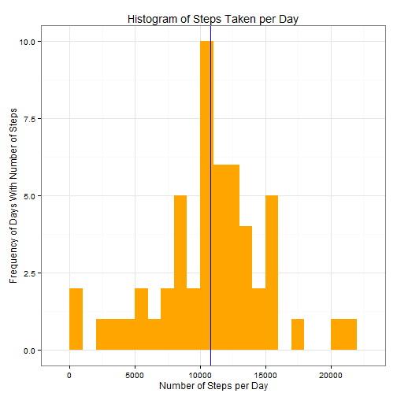

#Data
Dataset: Activity monitoring data [52K]
The variables included in this dataset are:

**steps**: Number of steps taking in a 5-minute interval (missing values are coded as NA)

**date**: The date on which the measurement was taken in YYYY-MM-DD format

**interval**: Identifier for the 5-minute interval in which measurement was taken

The dataset is stored in a comma-separated-value (CSV) file and there are a total of 17,568 observations in this dataset.

##Loading packages, loading and preprocessing the data

```r
library(data.table)
```

```
## data.table 1.9.6  For help type ?data.table or https://github.com/Rdatatable/data.table/wiki
## The fastest way to learn (by data.table authors): https://www.datacamp.com/courses/data-analysis-the-data-table-way
```

```r
library(ggplot2) # we shall use ggplot2 for plotting figures
running <- read.csv('activity.csv', header = TRUE, sep = ",",
colClasses=c("numeric", "character", "numeric"))
```
Converting the **date** field to a Date Class and **interval** field to a factor classes helps us organize our data and reference it later.

```r
running$date <- as.Date(running$date, format = "%Y-%m-%d")
running$interval <- as.factor(running$interval)
```
Let's look at the data to see how our organization looks:

```r
str(running)
```

```
## 'data.frame':	17568 obs. of  3 variables:
##  $ steps   : num  NA NA NA NA NA NA NA NA NA NA ...
##  $ date    : Date, format: "2012-10-01" "2012-10-01" ...
##  $ interval: Factor w/ 288 levels "0","5","10","15",..: 1 2 3 4 5 6 7 8 9 10 ...
```

##What is the mean total number of steps taken per day?

To get the steps taken per day, or daily steps, we looks at an aggregate of steps on each given day and sum them in each day.

```r
daily_steps<- aggregate(steps ~ date, running, sum)
colnames(daily_steps) <- c("date","steps")
head(daily_steps)
```

```
##         date steps
## 1 2012-10-02   126
## 2 2012-10-03 11352
## 3 2012-10-04 12116
## 4 2012-10-05 13294
## 5 2012-10-06 15420
## 6 2012-10-07 11015
```
Next we look at the mean and median of the daily steps over the entire period. 

```r
mean_steps   <- mean(daily_steps$steps, na.rm=TRUE)
median_steps <- median(daily_steps$steps, na.rm=TRUE)
mean_steps 
```

```
## [1] 10766.19
```

```r
median_steps
```

```
## [1] 10765
```
The mean and median are very close. If we show the mean and median on a historgraph, I bet it will be difficult to tell them apart. Let's graph them on the histograph below and see.

```r
p<-ggplot(daily_steps, aes(x = steps)) + 
       geom_histogram(fill = "orange", binwidth = 1000) + 
        labs(title="Histogram of Steps Taken per Day", 
             x = "Number of Steps per Day", y = "Frequency of Days With Number of Steps") + theme_bw() 

pp<-p + geom_vline(xintercept = mean_steps, color="red") + geom_vline(xintercept = median_steps, color="blue")
pp
```

 

Yep, you can't tell that the median and mean are different visually, though according to our table above, the mean > median, suggesting positive (left) skew. 

##What is the average daily activity pattern?

To make a time-series plot of the 5-minute intervals, we should aggregate and find the mean of the 5-minute intervals and save them to a data frame.

```r
interval_steps <- aggregate(running$steps, by=list(interval = running$interval),FUN=mean, na.rm=TRUE)
#converting to integers to make plotting easier
interval_steps$interval <- 
        as.integer(levels(interval_steps$interval)[interval_steps$interval])
colnames(interval_steps) <- c("interval", "steps")
```
Time Series Plot of the average number of steps taken (averaged across all days) vs the five minute intervals.

```r
ggplot(interval_steps, aes(x=interval, y=steps)) +   
        geom_line(color="orange", size=1) +  
        labs(title="Average Daily Activity Pattern", x="Interval", y="Number of steps Per 5-Minute Interval") +theme_bw()
```

 

We see above there is a maximum around the 800 interval. Let's check:

```r
max_interval <- interval_steps[which.max(  
        interval_steps$steps),]
max_interval
```

```
##     interval    steps
## 104      835 206.1698
```

```r
interval_steps$interval
```

```
##   [1]    0    5   10   15   20   25   30   35   40   45   50   55  100  105
##  [15]  110  115  120  125  130  135  140  145  150  155  200  205  210  215
##  [29]  220  225  230  235  240  245  250  255  300  305  310  315  320  325
##  [43]  330  335  340  345  350  355  400  405  410  415  420  425  430  435
##  [57]  440  445  450  455  500  505  510  515  520  525  530  535  540  545
##  [71]  550  555  600  605  610  615  620  625  630  635  640  645  650  655
##  [85]  700  705  710  715  720  725  730  735  740  745  750  755  800  805
##  [99]  810  815  820  825  830  835  840  845  850  855  900  905  910  915
## [113]  920  925  930  935  940  945  950  955 1000 1005 1010 1015 1020 1025
## [127] 1030 1035 1040 1045 1050 1055 1100 1105 1110 1115 1120 1125 1130 1135
## [141] 1140 1145 1150 1155 1200 1205 1210 1215 1220 1225 1230 1235 1240 1245
## [155] 1250 1255 1300 1305 1310 1315 1320 1325 1330 1335 1340 1345 1350 1355
## [169] 1400 1405 1410 1415 1420 1425 1430 1435 1440 1445 1450 1455 1500 1505
## [183] 1510 1515 1520 1525 1530 1535 1540 1545 1550 1555 1600 1605 1610 1615
## [197] 1620 1625 1630 1635 1640 1645 1650 1655 1700 1705 1710 1715 1720 1725
## [211] 1730 1735 1740 1745 1750 1755 1800 1805 1810 1815 1820 1825 1830 1835
## [225] 1840 1845 1850 1855 1900 1905 1910 1915 1920 1925 1930 1935 1940 1945
## [239] 1950 1955 2000 2005 2010 2015 2020 2025 2030 2035 2040 2045 2050 2055
## [253] 2100 2105 2110 2115 2120 2125 2130 2135 2140 2145 2150 2155 2200 2205
## [267] 2210 2215 2220 2225 2230 2235 2240 2245 2250 2255 2300 2305 2310 2315
## [281] 2320 2325 2330 2335 2340 2345 2350 2355
```
The maximum is 206 steps at the 835th interval. From the chart above on the interval_steps$interval function, we see that the 835th interval is equivalent to 8 hours and 35 minutes, or following clock time, 8:35am.

##Inputing Missing Values:
**Total Number of Missing Values:**

```r
sum(is.na(running$steps))
```

```
## [1] 2304
```
2304 missing values out of a total of 17568 values is a 13.1% loss. We should compensate for the missing values to increasing the accuracy.

**Strategy for filling in all of the missing values in the dataset**

We replace the missing values with the mean value of at the same interval across all days. 
We create a function na-noNA(data,pervalue) where the data arguement is the running data frame and pervalue arguement is the inteval-steps data frame.

```r
na_noNA <- function(data, pervalue) {
        na_index <- which(is.na(data$steps))
        na_replace <- unlist(lapply(na_index, FUN=function(idx){
                interval = data[idx,]$interval
                pervalue[pervalue$interval == interval,]$steps
        }))
        noNA_steps <- data$steps
        noNA_steps[na_index] <- na_replace
        noNA_steps
}

running_noNA <- data.frame(  
        steps = na_noNA(running, interval_steps),  
        date = running$date,  
        interval = running$interval)
str(running_noNA)
```

```
## 'data.frame':	17568 obs. of  3 variables:
##  $ steps   : num  1.717 0.3396 0.1321 0.1509 0.0755 ...
##  $ date    : Date, format: "2012-10-01" "2012-10-01" ...
##  $ interval: Factor w/ 288 levels "0","5","10","15",..: 1 2 3 4 5 6 7 8 9 10 ...
```
This time, we see that the NA's are replaced by numbers, but we still have the same number of observations of 3 variables. Now, we should just check to make sure we didn't miss any of the NA's:

```r
sum(is.na(running_noNA$steps))
```

```
## [1] 0
```
We did not.

**A histogram of the total numbers of steps taken each day
Below is a histogram with our new data set:

```r
noNA_daily_steps <- aggregate(steps ~ date, running_noNA, sum)
colnames(noNA_daily_steps) <- c("date","steps")
noNA_mean_steps   <- mean(noNA_daily_steps$steps, na.rm=TRUE)
noNA_median_steps <- median(noNA_daily_steps$steps, na.rm=TRUE)

##plotting the histogram
q<-ggplot(noNA_daily_steps, aes(x = steps)) + 
       geom_histogram(fill = "blue", binwidth = 1000) + 
        labs(title="Histogram of Steps Taken per Day", 
             x = "Number of Steps per Day", y = "Frequency of Days with Number of Steps") + theme_bw() 
qq<-q+geom_vline(xintercept = noNA_mean_steps, color="red") + geom_vline(xintercept = noNA_median_steps, color="orange")
```
It looks a little different. Let's compare the two side by side to see what looks different:

```r
require(gridExtra)
```

```
## Loading required package: gridExtra
```

```r
grid.arrange(pp,qq,ncol=2)
```

 
It looks more normally distributed. The maximum is still highly obvious.

**Do these values differe from the estimates of the first part of the assignment?**

```r
df<-data.frame(c(mean_steps,median_steps),c(noNA_mean_steps,noNA_median_steps))
names(df)[1]<-"Before"
names(df)[2]<-"After"
rownames(df)[1]<-"Mean"
rownames(df)[2]<-"Median"
df
```

```
##          Before    After
## Mean   10766.19 10766.19
## Median 10765.00 10766.19
```
Yes, they do. The median now matches the mean. This would also explain why the historgram looks more even. 

**What is the impact of inputting missing data on the estimate of the total daily number of steps?**

The mean has not changed, but the median moved to match the mean. This suggests the mean has become a better approximator of the average of our data, and skew is eliminated. The maximum frequency of days with numbers of steps has increased. This suggests more of the NA data occurred during peak times. This could suggest problems with the device measurements during higher intensity periods.

**Are there differences in activity patterns between weekdays and weekends?**

We will use our new data set with fill-in missing values.
First, we will add a column to the table that indicates the day of the week.

```r
weekdays_steps <- function(data) {
    weekdays_steps <- aggregate(data$steps, by=list(interval = data$interval),
                          FUN=mean, na.rm=T)
    # convert to integers for plotting
    weekdays_steps$interval <- 
            as.integer(levels(weekdays_steps$interval)[weekdays_steps$interval])
    colnames(weekdays_steps) <- c("interval", "steps")
    weekdays_steps
}
```
Then subset the table into two parts: weekends and weekdays.
Tabulate weekend-steps and weekday-steps (in same form as intefvalsteps earlier, but with a column designating for weekends and weekdays)

```r
data_by_weekdays <- function(data) {
    data$weekday <- 
            as.factor(weekdays(data$date)) # weekdays
    weekend_data <- subset(data, weekday %in% c("Saturday","Sunday"))
    weekday_data <- subset(data, !weekday %in% c("Saturday","Sunday"))

    weekend_steps <- weekdays_steps(weekend_data)
    weekday_steps <- weekdays_steps(weekday_data)

    weekend_steps$dayofweek <- rep("weekend", nrow(weekend_steps))
    weekday_steps$dayofweek <- rep("weekday", nrow(weekday_steps))

    data_by_weekdays <- rbind(weekend_steps, weekday_steps)
    data_by_weekdays$dayofweek <- as.factor(data_by_weekdays$dayofweek)
    data_by_weekdays
}

data_weekdays <- data_by_weekdays(running_noNA)
```
And plot the two graphs next to each other. We can use the facet-wrap function because both charts draw from the same data set.

```r
ggplot(data_weekdays, aes(x=interval, y=steps)) + 
        geom_line(color="violet") + 
        facet_wrap(~ dayofweek, nrow=1, ncol=2) +
        labs(x="Interval", y="Number of steps") +
        theme_bw()
```

 

We see above that weekdays have a higher maximum peak than weekends, but weekends have more consistently high levels throughout the days. If our subject is rushing to work in the morning, like many people do, and works in an office most of the day, then this would account for our weekday data. And on the weekends, more consistent effort on other things besides working in a office, would show as we expect. We also see that the number of steps drop off later in the evening on weekends than weekdays, which is to be expected.
